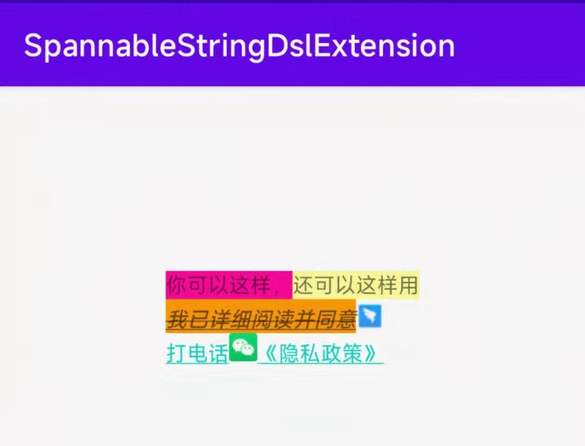

# SpannableStringDslExtension

思路见文章[在 Kotlin 中巧妙的使用 DSL 封装 SpannableStringBuilder](https://juejin.cn/post/7067325056124190734)

相比文章做了更多的扩展，利用 kotlin 语法糖做了一些有趣的事情，欢迎star & PR。

使用：
` implementation 'xyz.junerver.ssktx:ss-ktx:0.0.1'`

通过一个扩展函数，使用 DSL 风格的代码，轻松的构建 SpannableString ：




```kotlin
textView.buildSpannableString {
   "你可以这样，".asSpannableString {
       setBackgroundColor("#ff0099")
   }
   "还可以这样用"{
       setBackgroundColor("#ffff99")
   }
   addText("\n我已详细阅读并同意") {
       setBackgroundColor("#FF9900")
       setStyle(Typeface.BOLD_ITALIC)
       userUnderLine()
       useStrikethrough()
       setDrawableRight(R.drawable.icon_dingding, DynamicDrawableSpan.ALIGN_CENTER)
   }
   addText("\n打电话") {
       asURL("tel:10086")
   }
   addText("《隐私政策》") {
       setForegroundColor("#0099FF")
       setDrawableLeft(R.drawable.icon_wechat)
       onClick {

       }
   }
}
```
